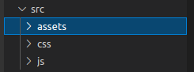

# Search by time GitHub

<!-- PROJECT SHIELDS -->

[![Forks][forks-shield]][forks-url]
[![Stargazers][stars-shield]][stars-url]
[![Issues-open][issues-open-shield]][issues-url]
[![Issues-closed][issues-closed-shield]][issues-url]
[![Contributors][contributors-shield]][contributors-url]

<!-- PROJECT LOGO -->

|                                                   A tool to do search by time in GitHub repositories                                                |
| :------------------------------------------------------------------------------------------------------: |
|                                              ![app-icon][]                                               |
|Azordev's tracking issues and pull request tool|
|                          [🐞 Report a bug or 🙋‍♂️ request a feature][issues-url]                           |
| [![contributions welcome][contributions-welcome]][issues-url] [![License][badge-apache]][apache-license] |

- [Search by time GitHub](#search-by-time-github)
  - [Search by time Github docs](#search-by-time-github-docs)
  - [How to run the project:](#how-to-run-the-project)
    - [Pre requirements](#pre-requirements)
    - [Let's to run it](#lets-to-run-it)
    - [Features](#features)
    - [Built With](#built-with)
  - [File Structure:](#file-structure)
  - [GIT USE:](#git-use)
  - [Collaborators](#collaborators)
  - [Contributing](#contributing)
  - [Show your support](#show-your-support)
  - [License](#license)


## Search by time Github docs

A tool to help you to search at GitHub Issues / Pull Request by time filters.

Sometimes we need search on some repository, old issues or pull request, or simply needs to check the amount of issues closed in a range of time, to check our productivity or the productivity of another developer. This GUI to do search in GitHub using days filters should be easy of use for any person and should allow to you search easily in the time that you want search.

## How to run the project:

As vanilla javascript project, you can run it of multiple ways, for example u can just open the `index.html` file in your browser since it not requires a compile process, and you will have already run the project. I propose the following way:

### Pre requirements

1. [Visual Studio Code](https://code.visualstudio.com/) or another code editor (optional)
2. [Live Server VSCode extension](https://marketplace.visualstudio.com/items?itemName=ritwickdey.LiveServer) or another extension for live reload

### Let's to run it

1. Open the project as a new workspace in your code editor.
2. Start the live server extension. 
3. Start to develop!

### Features

![javascript][]
![css][]

- Vanilla JavaScript
- Vanilla CSS
- Functional programming paradigm
- Simply develop without frameworks, not dependencies, simply deploy, so fast how develop and check in your browser

### Built With

- `vscode`
- Linux/GNU, macOS, Windows
- Love and Passion for code

## File Structure:

This is a little project, it requires to apply good practices to maintain simple the code, and for it we need apply a good file structure, creating the necessary modules to do each part of the code easy to modify. By it I have applied the typic "src" structure, where is saved all the code of the project. Except by index.html that is out of src to do more easy the deploy of the APP. In src you will find some interesting folders and files

<table border="0">
    <td width="300px">
        
    </td>
    <td>
        <b>assets:</b> In this folder we place all the graphic resources. If you need to add / use a new image, this is the site.<br/><br/>
        <b>css:</b> Here we save all the styles of the application, doing possible to do multiple css files if is needed and maintaining the order in the code.<br/><br/>
        <b>js:</b> Here we save all the JavaScript code modules that we can import in the index.html file.<br/><br/>   
    </td>
</table>

## GIT USE:

There are some rules that apply when interacting with the project repository. This will allow us to have a standard that any developer can understand. It is important to comply with these rules so that the linting tool allows us to use the repository.

**Branch:**

Every time an issue is assigned to you, you must create a new branch. This can be done through the command:

```
git branch <name of branch>
```

For convenience, the branches should have a defined structure. For example, if the issue is about adding a new feature, the branch should be:

```
feature/#issuenumber-brief-description-of-the-feature
```

Suppose we have issue #12 that asks us to add a header to the main page. Then, the branch would be as follows:

```
feature/#12-add-header-to-main-page
```

If it is about solving a bug, we just have to put the word "fix" in front of it. For example:

```
fix/#14-remove-bad-media-queries-in-rating-component
```

**Commits:**

Like branches, commits must also follow a format. Notice how the commit message varies if it is a feature or a bug fix.

**feat**: added header to main page

**fix**: removed bad media queries in rating component

**Pull Request (PR):**

The PR’s are requests that as developers we make once the solution of an issue is completed and we want the code to be integrated into the master branch of the project. Before that, we must ensure that our code is fully functional and adhering to best practices.

Once we have done a commit & push in our branch, a notification with a yellow background will appear in the github repository and will ask us to continue with the PR. In the TextArea to perform the PR you will find several sections that you want to complete: A brief description of what you did, a snapshot (if applicable), the tasks that were completed and the steps to view them.

## Collaborators

| [Israel Laguan][author-github] | ![email-icon][] Email me to [contact@israellaguan.com][author-email] / ![linkedin-icon][] Connect to [my Linkedin][author-linkedin] |
| :----------------------------: | :---------------------------------------------------------------------------------------------------------------------------------: |
|        ![author-pic][]         |                                                                                                                          |
|  [Victor Peña][victor-github]  |  ![email-icon][] Email me to [victordev2002@gmail.com][victor-email] / ![linkedin-icon][] Connect to [my Linkedin][victor-linkedin]    |
|        ![victor-pic][]         |                                                                                                                          |
|[Emmanuel Azócar][emmanuel-github]|                          ![email-icon][] Email me to [azocarmel@gmail.com][emmanuel-email]                                       |
|        ![emmanuel-pic][]        |                                                                                                                          |
| [Angelica Molina][ange-github] |                              ![email-icon][] Email me to [angeli.molina1@gmail.com][ange-email]                                     |
|         ![ange-pic][]         |                                                                                                                          |

## Contributing

[![contributions welcome][contributions-welcome]][issues-url]

🤝 Contributions, issues and feature requests are welcome!
Feel free to check the [issues page][issues-url].

## Show your support

🤗 Give a ⭐️ if you like this project!

- <https://blog.logrocket.com/deep-dive-into-lefthook-react-native/>
- <https://blog.logrocket.com/build-robust-react-app-husky-pre-commit-hooks-github-actions/>
- Favicon from [favicon.io](https://favicon.io/emoji-favicons/)
- <https://www.seoptimer.com/meta-tag-generator>
- <https://dev.to/nitzano/linting-docker-containers-2lo6?utm_source=lefthook>

## License

[![License][badge-apache]][apache-license]

📝 This project is licensed under the [Apache 2](LICENSE)\
Feel free to fork this project and improve it!

<!-- MARKDOWN LINKS & IMAGES -->

[victor-github]: https://github.com/Katsu08
[victor-pic]: https://avatars.githubusercontent.com/u/66505715?v=4
[victor-email]: mailto:victordev2002@gmail.com
[victor-linkedin]: https://www.linkedin.com/in/v%C3%ADctor-pe%C3%B1a-348a3918a/

[emmanuel-github]: https://github.com/e-azocar
[emmanuel-pic]: https://avatars.githubusercontent.com/u/61360270?v=4
[emmanuel-email]: mailto:azocarmel@gmail.com

[roman-github]: https://github.com/romanrguez192
[roman-pic]: https://avatars.githubusercontent.com/u/69876913?s=200&v=4
[roman-email]: mailto:romanrodri192@gmail.com

[tony-github]: https://github.com/Tonytarco
[tony-pic]: https://avatars.githubusercontent.com/u/37258801?s=200&v=4
[tony-email]: mailto:tonytarco@hotmail.com

[ange-github]: https://github.com/angelik0828
[ange-pic]: https://avatars.githubusercontent.com/u/4030477?s=200&v=4
[ange-email]: mailto:angeli.molina1@gmail.com

[ild-github]: https://github.com/ildebr
[ild-pic]: https://avatars.githubusercontent.com/u/73916430?v=4
[ild-email]: mailto:ildebrandoefrain@gmail.com


[contributors-shield]: https://img.shields.io/github/contributors/Azordev/frontend-template?style=for-the-badge
[contributors-url]: https://github.com/Azordev/frontend-template/graphs/contributors

[forks-shield]: https://img.shields.io/github/forks/Azordev/frontend-template?style=for-the-badge 
[forks-url]: https://github.com/Azordev/frontend-template/network/members

[stars-shield]: https://img.shields.io/github/stars/Azordev/frontend-template?style=for-the-badge
[stars-url]: https://github.com/Azordev/frontend-template/stargazers

[issues-open-shield]: https://img.shields.io/github/issues/Azordev/frontend-template?style=for-the-badge
[issues-closed-shield]: https://img.shields.io/github/issues-closed/Azordev/frontend-template?style=for-the-badge

[javascript]: https://img.shields.io/badge/JAVASCRIPT-ES6%2B-F7DF1E?style=for-the-badge&logo=javascript
[css]: https://img.shields.io/badge/style-CSS-1572B6?style=for-the-badge&logo=css3
[builtwithlove]: https://forthebadge.com/images/badges/built-with-love.svg
[contributions-welcome]: https://img.shields.io/badge/contributions-welcome-brightgreen.svg?style=for-the-badge
[issues-url]: https://github.com/Azordev/frontend-template/issues
[badge-apache]: https://img.shields.io/badge/License-Apache%202.0-blue.svg?style=for-the-badge
[apache-license]: https://opensource.org/licenses/Apache-2.0
[author-pic]: https://avatars2.githubusercontent.com/u/36519478?s=460&v=4
[author-github]: https://israel-laguan.github.io
[author-linkedin]: https://www.linkedin.com/in/israellaguan
[author-email]: mailto:contact@israellaguan.com
[linkedin-icon]: https://img.icons8.com/color/20/000000/linkedin.png
[email-icon]: https://img.icons8.com/color/20/000000/message-squared.png
[banner]: https://github.com/Israel-Laguan/Israel-Laguan/raw/master/docs/banner.jpg
[app-banner]: docs/app-banner.png
[app-icon]: public/logo.png
[icons8]: https://icons8.com/
[icons8-logo]: https://img.icons8.com/fluent/20/000000/icons8-new-logo.png
[api-logo]: https://spoonacular.com/images/spoonacular-logo-b.svg
